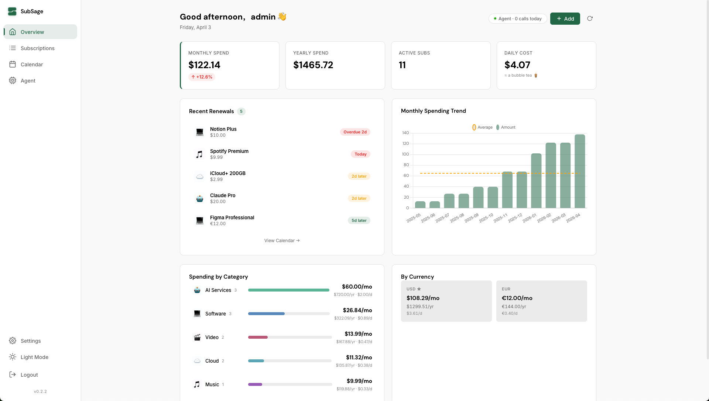
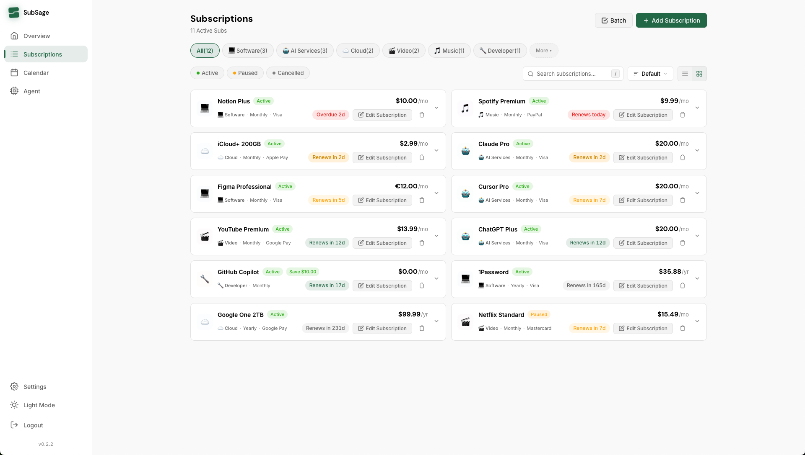
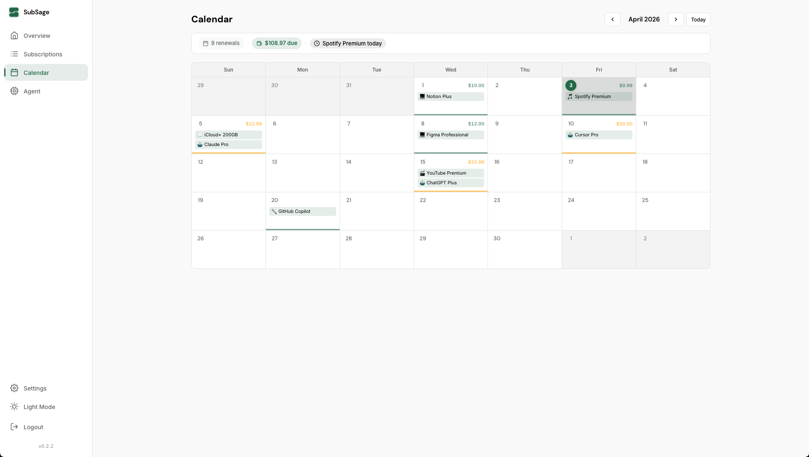
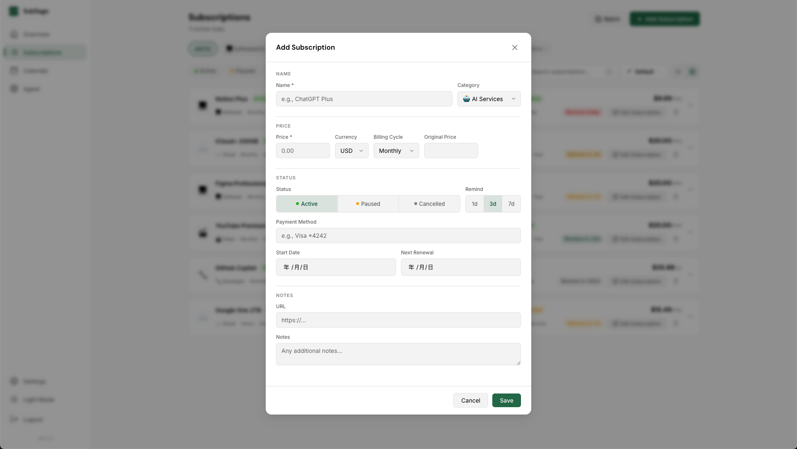
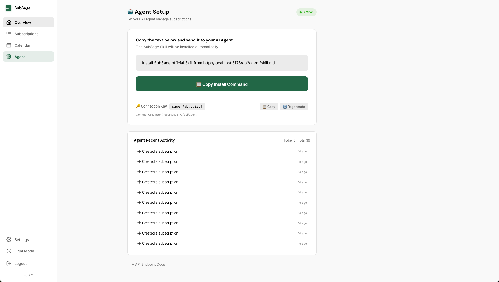
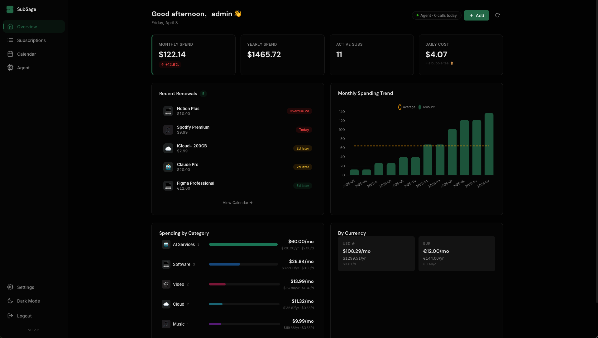
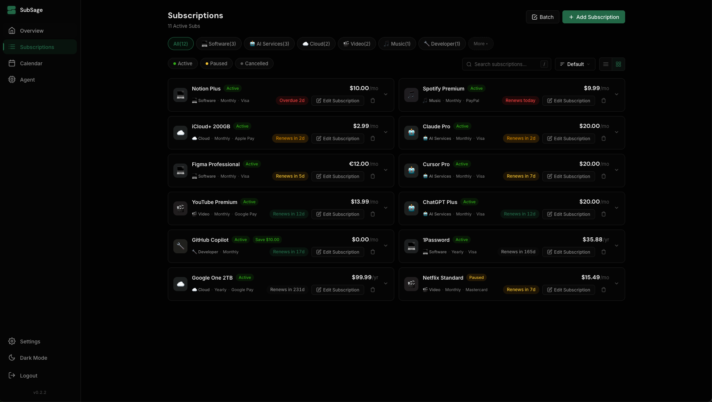
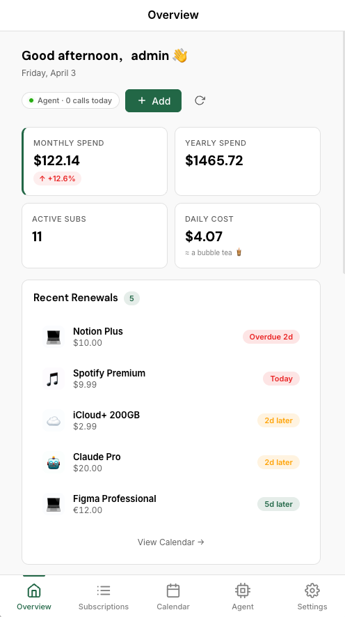
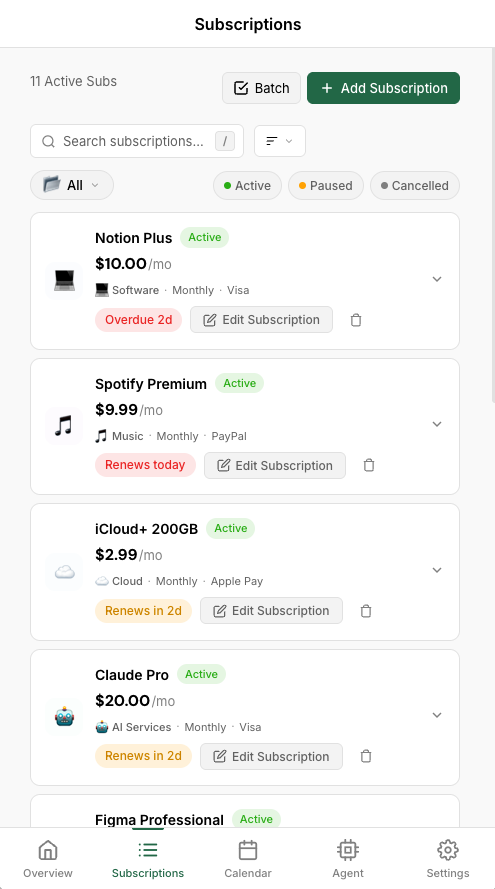

# 🌱 SubSage

> 掌控每一笔订阅。自托管、轻量、AI Agent 原生。

SubSage 是一个自托管的订阅管理工具，**和你的 AI Agent 协同工作**。通过简单的指令，让你的 AI Agent 来管理所有订阅。复制一段话，Agent 就全搞定了。

[English](./README.md) · [中文](./README_zh.md)

---

## 🤖 用 AI Agent 部署

有 Cursor、Cline、Windsurf 等编程 Agent？复制以下任意一段发给它：

**方式 A — 脚本安装（无需 Docker）：**

> 运行 `curl -fsSL https://raw.githubusercontent.com/wangjc683/subsage/main/install.sh | bash` 安装 SubSage，启动后在浏览器打开 http://localhost:8321

**方式 B — Docker：**

> 运行 `docker run -d --name subsage -p 8321:8321 -v subsage-data:/data wangjc683/subsage`，启动后在浏览器打开 http://localhost:8321

就这样。Agent 执行一条命令就搞定，零手动操作。

---

## 🎬 Agent 真实使用场景

SubSage 接入 Agent 后，管订阅就变成了聊天：

**记录新订阅**
> 🗣 *"我刚订阅了 Claude Pro，20 美元/月，Visa 支付"*
>
> 🤖 *搞定！已添加 Claude Pro — $20/月，AI 分类。你的 AI 月度总支出现在是 $45。*

**查看即将续费**
> 🗣 *"这周有什么要续费的？"*
>
> 🤖 *2 笔续费：Spotify（$9.99，明天）和 iCloud+（$2.99，周五）。*

**批量管理**
> 🗣 *"把 Netflix 取消，Midjourney 暂停"*
>
> 🤖 *搞定。Netflix → 已取消，Midjourney → 已暂停。每月节省 $28.98。*

**支出分析**
> 🗣 *"我在 AI 工具上花了多少钱？"*
>
> 🤖 *5 个 AI 订阅，合计 $89/月。最贵的：ChatGPT Plus ($20)、Claude Pro ($20)、Cursor ($20)。*

**灵活操作**
> 🗣 *"我拿到了 GitHub 学生包，把 Copilot 标记为免费"*
>
> 🤖 *已更新 Copilot：价格 $0，折扣备注「GitHub 学生包」。开发类月支出减少 $10。*

不用切换应用，不用填表单。告诉 Agent 就行。

如果你的Agent支持视觉理解，你甚至都不需要输入文字，直接给它看账单截图就行，Agent和SubSage会帮你搞定一切。

---

## ✨ 功能亮点

- 🤖 **AI Agent 原生** — 一键复制指令，适配任何 Agent
- 💳 **订阅管理** — 完整增删改查，10 种内置分类 + 自定义
- 💱 **多币种** — 自动汇率换算，统一为基准货币
- 📊 **支出统计** — 月/年/日均支出，图表可视化
- 📅 **日历视图** — 续费时间线一目了然
- 💰 **折扣追踪** — 原价、实付价、折扣说明
- 📤 **导入导出** — Excel 和 JSON 备份
- 🌙 **深色 / 浅色 / 跟随系统** — 三种主题
- 🌐 **中英双语** — 自动检测浏览器语言
- 📱 **响应式** — 桌面 + 移动端，支持 PWA
- 🔒 **自托管** — 数据完全在你自己手上

---

## 📸 界面预览

| 总览仪表盘 | 订阅管理 |
|-----------|---------|
|  |  |

| 日历视图 | 编辑弹窗 |
|---------|---------|
|  |  |

| Agent 对接 | |
|-----------|---|
|  | |

### 🌙 深色模式

| 总览 | 订阅 |
|------|------|
|  |  |

### 📱 移动端

| 总览 | 订阅 |
|------|------|
|  |  |

---

## 🚀 快速开始

### 一键安装（无需 Docker）

```bash
curl -fsSL https://raw.githubusercontent.com/wangjc683/subsage/main/install.sh | bash
```

自动检测操作系统（Linux/macOS）和架构（amd64/arm64），下载二进制文件并注册系统服务。

### Docker 部署（推荐用于服务器）

**一行命令：**

```bash
docker run -d --name subsage -p 8321:8321 -v subsage-data:/data wangjc683/subsage
```

**或者用 Docker Compose：**

```bash
curl -O https://raw.githubusercontent.com/wangjc683/subsage/main/docker-compose.yml
docker compose up -d
```

打开 [http://localhost:8321](http://localhost:8321) — 首次访问会提示创建管理员账户。

> 支持 `linux/amd64` 和 `linux/arm64`（NAS、树莓派、Apple Silicon）。

### 手动部署

```bash
# 后端
cd backend && go run main.go

# 前端（新终端）
cd frontend && npm install && npm run dev
```

### 环境变量

| 变量 | 说明 | 默认值 |
|------|------|--------|
| `SAGE_DB_PATH` | SQLite 数据库路径 | `/data/sage.db` |
| `SAGE_PORT` | 监听端口 | `8321` |
| `SAGE_JWT_SECRET` | JWT 签名密钥（留空自动生成） | 自动 |
| `TZ` | 时区 | `UTC` |

### 备份与恢复

```bash
docker cp subsage:/data/sage.db ./backup.db    # 备份
docker cp ./backup.db subsage:/data/sage.db     # 恢复
docker restart subsage
```

---

## 🔄 升级

SubSage 的数据存储在 SQLite 数据库中，升级不会丢失数据。

### 脚本安装升级

```bash
# 重新运行安装脚本 — 自动下载最新版本
curl -fsSL https://raw.githubusercontent.com/wangjc683/subsage/main/install.sh | bash
```

### Docker 升级

```bash
# 1. 备份（推荐）
docker cp subsage:/data/sage.db ./sage-backup-$(date +%Y%m%d).db

# 2. 拉取最新镜像并重启
docker pull wangjc683/subsage:latest
docker stop subsage && docker rm subsage
docker run -d --name subsage -p 8321:8321 -v subsage-data:/data wangjc683/subsage
```

### 用 Agent 升级

SubSage 是 Agent 原生的 —— 升级也可以是一段对话。把下面这段发给你的 Agent：

> 检查我部署的 SubSage 当前版本，然后查询 https://github.com/wangjc683/subsage/releases 的最新版本。如果有新版本，告诉我更新内容，问我是否要升级。如果我确认，执行更新操作，然后验证版本号已更新。

### 版本历史

完整更新日志见 [GitHub Releases](https://github.com/wangjc683/subsage/releases)。

| 版本 | 亮点 |
|------|------|
| v0.2.2 | 列表/网格视图切换、弹窗表单重构（分段控件、styled selects）、总览布局合并、动态日成本提示、无障碍优化 |
| v0.2.1 | 日历页重构（内联展开、统计条、智能跳转）、设置页主题下拉修复 |
| v0.2.0 | 移动端底部 Tab Bar、设置页主题/登出、Notion 风格深色模式、呼吸感微交互 |
| v0.1.1 | Bug 修复：日历刷新、主题标签、分类名称；移动端 UX 全面优化 |
| v0.1.0 | 共享编辑弹窗、日历 UX 重构、Chart.js 修复、i18n 完善 |
| v0.0.1 | 首次发布 — 完整增删改查、Agent API、多币种、中英双语 |

---

## 🤖 接入你的 Agent

1. 打开 SubSage → 侧边栏点击 **Agent**
2. 点击 **「📋 一键复制指令」**
3. 发送给你的 AI Agent
4. Agent 自动安装 SubSage Skill

所有 Agent API 使用 `X-API-Token` header 认证。完整 API 文档见 [Agent 页面](http://localhost:8321/#/agent)。

---

## 🛠 技术栈

| 层 | 技术 |
|---|------|
| 后端 | Go 1.25 + Echo + SQLite |
| 前端 | Svelte 4 + Vite |
| 认证 | bcrypt + JWT（Web）/ API Token（Agent） |
| 图表 | Chart.js |
| 汇率 | open.er-api.com（免费，每日缓存） |
| 部署 | Docker 多阶段构建 |

---

## 📄 许可证

[MIT](./LICENSE) — 免费开源。
